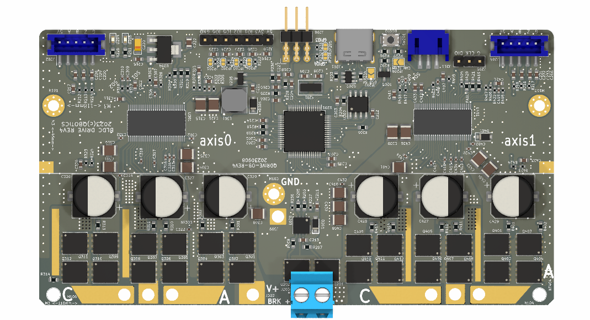

# QDrive 2axis version

A 2 axis High current BLDC motor controller board based and compatible with Odrive project (https://github.com/madcowswe/ODriveHardware).

Part of this project is based from azmat's single channel BLDC controller board (https://github.com/azmat-bilal/bldc_motor_controller_pcb.git)

## Introduction

  

## Odrive compatibility

This project is supposed to be compatible with odrive v3.6-56V.

## Announcement

This project is still in development and need modification to be working as expected. 